# CORTEX_MED

**AI-assisted hospital queue and patient-triage management system.**

CORTEX_MED helps hospitals and clinics see the most urgent patients first. When a
patient is booked, their symptoms are sent to a self-hosted AI triage engine that
estimates urgency (never a diagnosis), and the patient is placed into a live,
priority-ordered consultation queue that updates in real time for staff and for
the patient's own tracking page.

## Services

CORTEX_MED is a polyglot monorepo made of four containerized services:

| Service | Path | Stack | Docs |
|---|---|---|---|
| Frontend | [`client/`](client/README.md) | Next.js 15, React 19, TypeScript, Tailwind CSS v4 | [client/README.md](client/README.md) |
| Backend API | [`server/`](server/README.md) | Node.js, Express 5, MongoDB/Mongoose 9, Socket.IO | [server/README.md](server/README.md) |
| AI Triage Engine | [`ai-service/`](ai-service/README.md) | Python, FastAPI, Groq (Llama 3.1 8B Instant) | [ai-service/README.md](ai-service/README.md) |
| Orchestration | [`docker/`](docker/README.md) | Docker Compose | [docker/README.md](docker/README.md) |

Each service has its own README with full setup, API, and architecture details —
this file is a project-level overview and quick start only.

## How it works

1. A receptionist books an appointment with a patient's symptoms.
2. The backend forwards the symptoms to the AI triage engine, which returns an
   urgency priority (1–5), a confidence score, an explainable list of factors,
   a risk level, a recommended department, and a plain-language summary.
3. The patient is inserted into that doctor's live queue, sorted by priority
   then arrival order.
4. All connected dashboards and the patient's own tracking page update
   instantly over Socket.IO.
5. If the AI service is ever unreachable, booking still works — triage falls
   back to a safe neutral default priority instead of blocking or erroring.

The AI **never diagnoses, prescribes, or replaces a doctor's judgment** — it
only estimates urgency to help staff prioritize who is seen next.

## User roles

| Role | How it's created | What it can do |
|---|---|---|
| `admin` | Cannot self-register; created directly | Manage doctors/staff, hospital settings, view analytics |
| `doctor` | Self-registers, or created by an admin | Own consultation queue, emergency intake |
| `receptionist` | Self-registers | Book appointments, run the live queue, manage doctor directory |
| Patient (anonymous) | No account | Track their own appointment by code, no login required |

## Screenshots

### Landing & authentication

| Landing page | Login | Doctor registration | Receptionist registration |
|---|---|---|---|
| 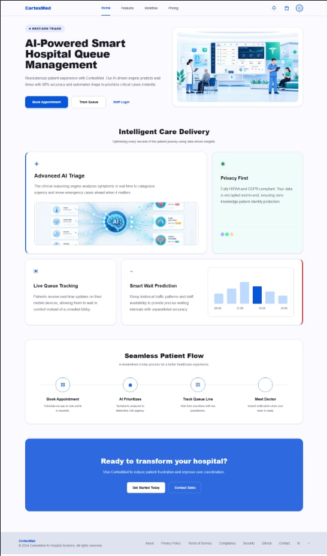 | 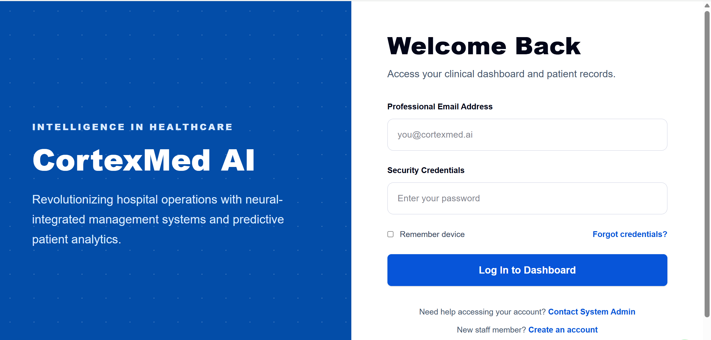 |  |  |

### Administrator

Manage doctors/staff, hospital settings, and view analytics.

| Dashboard (1/2) | Dashboard (2/2) |
|---|---|
| 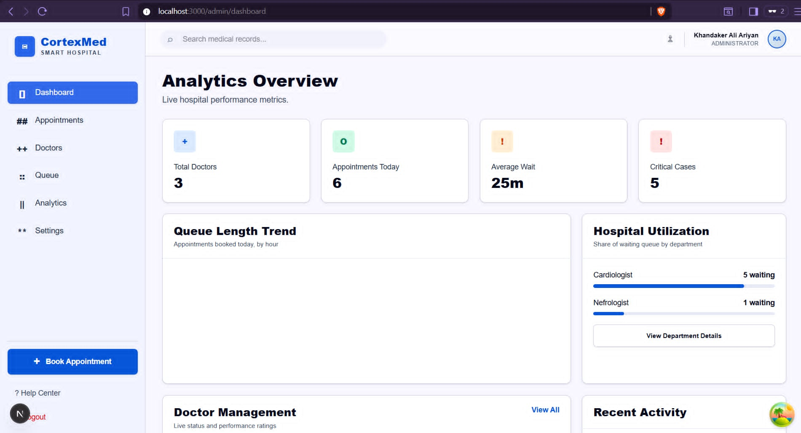 | 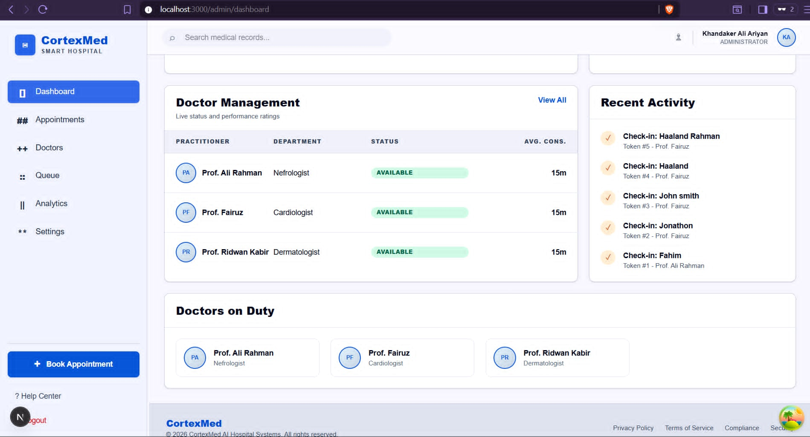 |

| Analytics | Appointments |
|---|---|
| 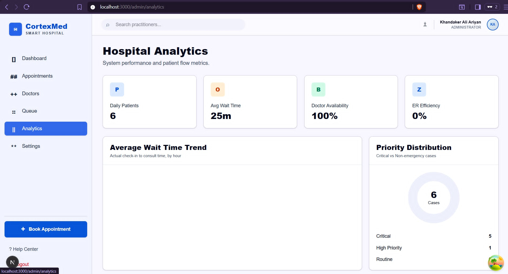 | 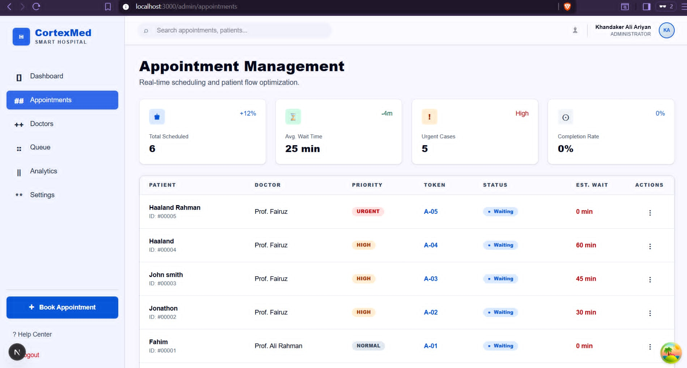 |

| Doctors | Queue | Settings |
|---|---|---|
| 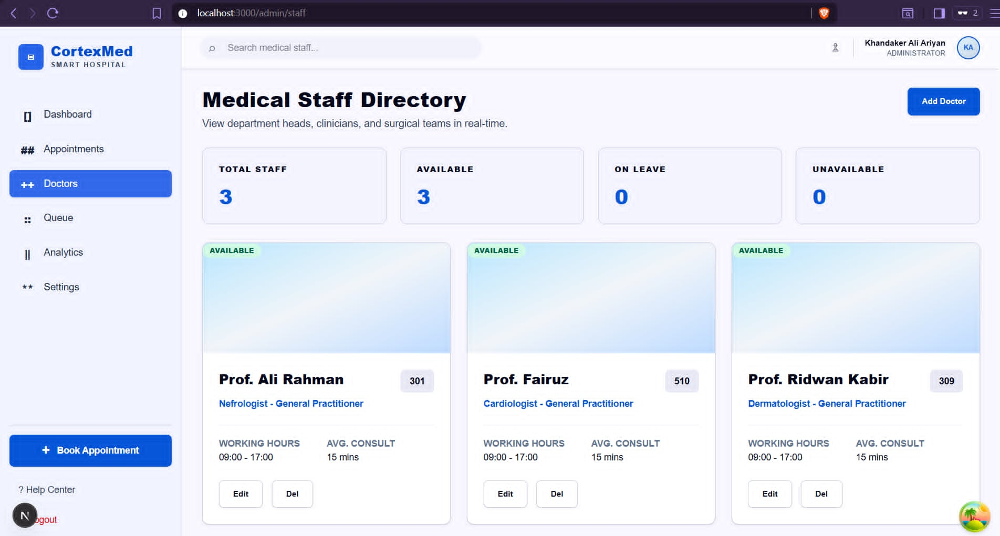 | 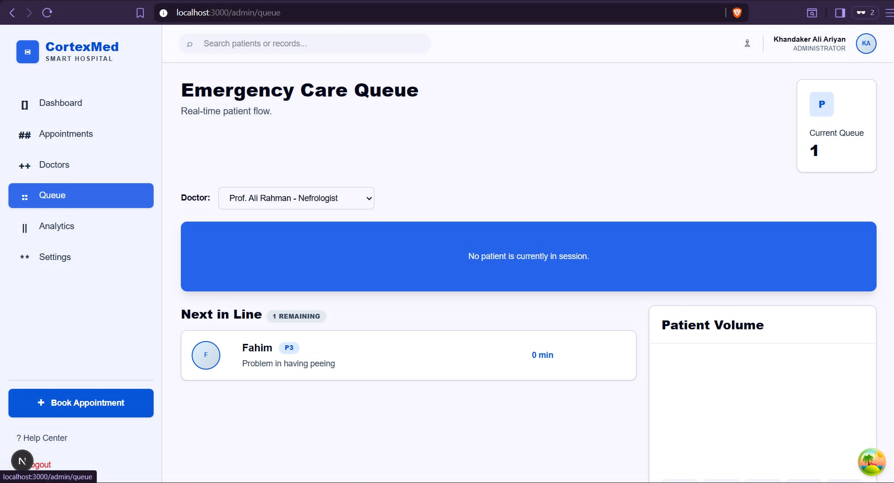 | 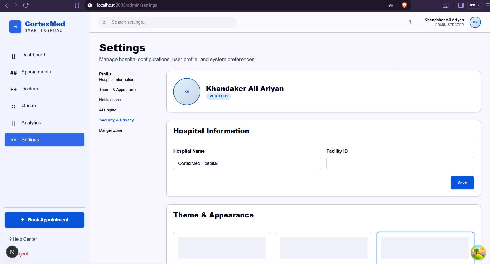 |

### Doctor

Own consultation queue and emergency intake.

| Dashboard (1/2) | Dashboard (2/2) |
|---|---|
| 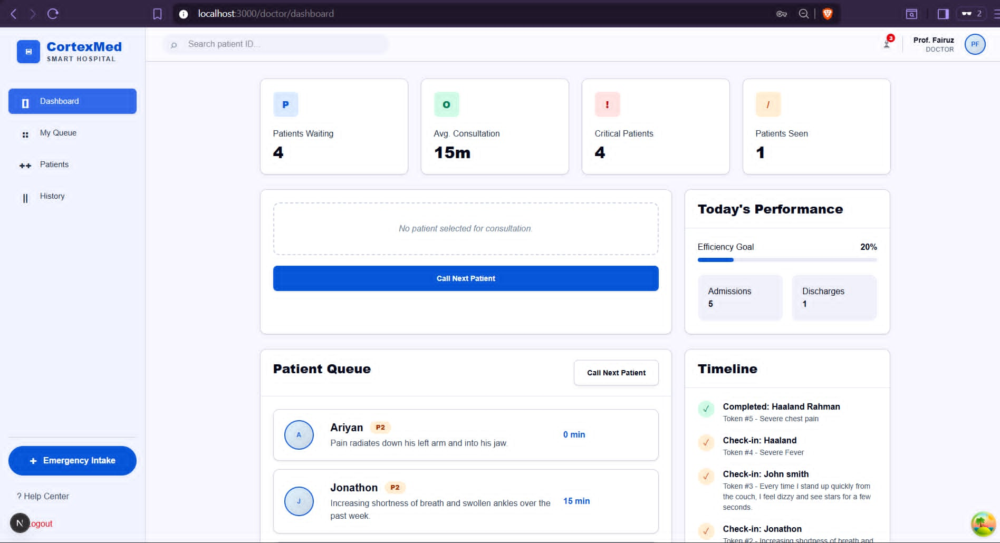 | 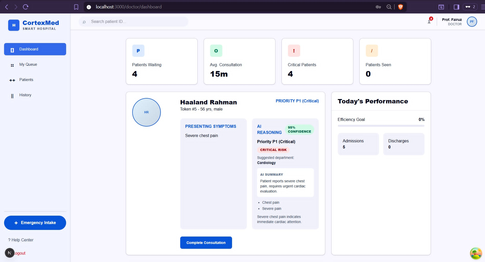 |

| History | Patient |
|---|---|
| 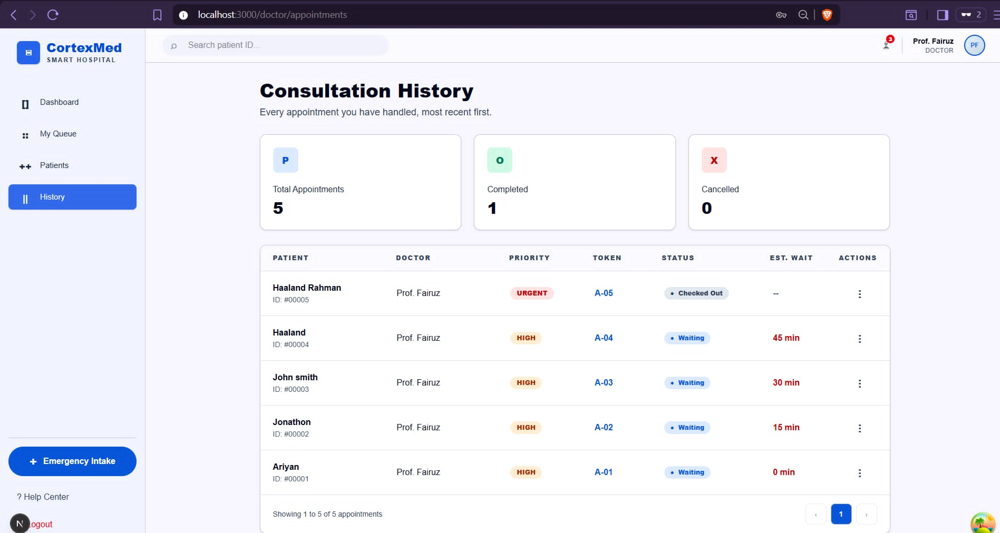 | 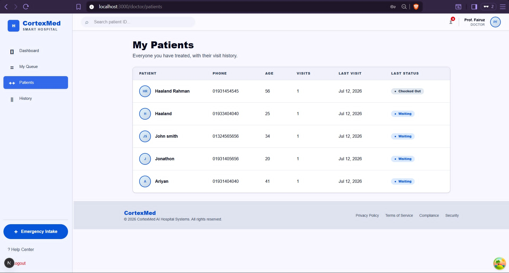 |

### Receptionist / Front desk

Book appointments, run the live queue, and manage the doctor directory.

| Dashboard (1/2) | Dashboard (2/2) |
|---|---|
| 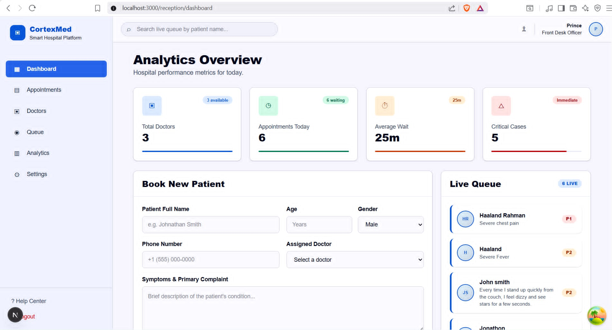 | 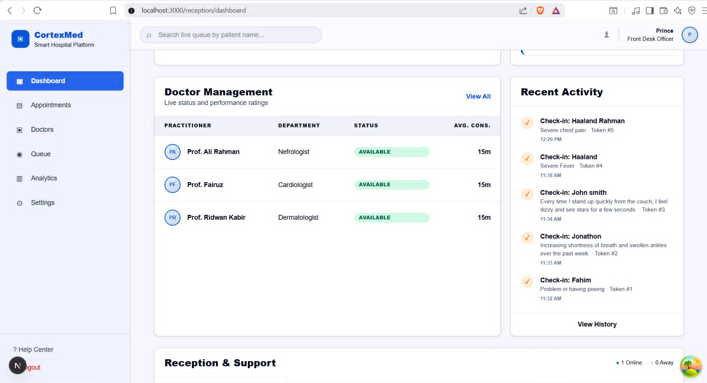 |

| Appointments | Doctors | Queue |
|---|---|---|
| 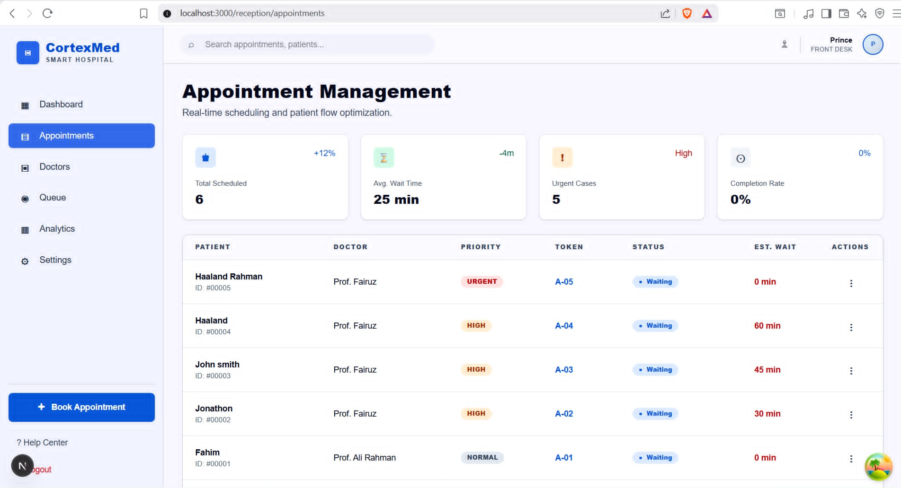 | 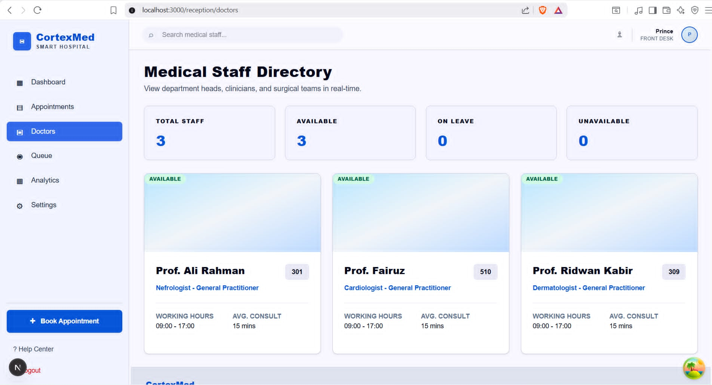 | 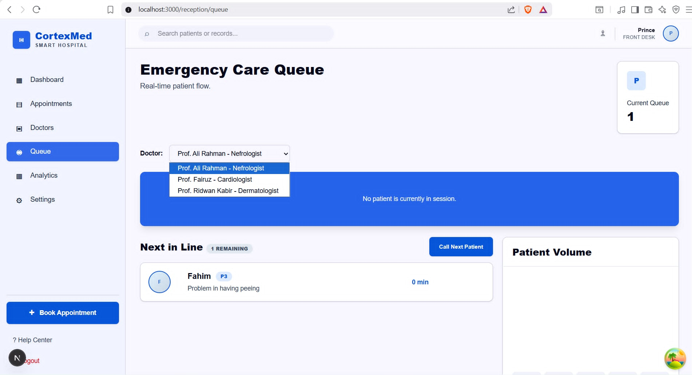 |

## Quick start (Docker — all four services)

**Prerequisites:** Docker Desktop (or Docker Engine + Compose v2 on Linux).

1. Create `server/.env`:
   ```
   PORT=5000
   DATABASE_URL=mongodb://localhost:27017/CORTEX_MED
   NODE_ENV=development
   CLIENT_URL=http://localhost:3000
   JWT_ACCESS_SECRET=change_me
   JWT_ACCESS_EXPIRES_IN=15m
   JWT_REFRESH_SECRET=change_me_too
   JWT_REFRESH_EXPIRES_IN=7d
   ```
   (Docker Compose overrides `DATABASE_URL`, `CLIENT_URL`, and `AI_SERVICE_URL`
   to point at the containers automatically.)

2. (Optional, for real AI triage instead of the neutral fallback) create
   `docker/.env` with a free [Groq](https://console.groq.com) API key:
   ```
   GROQ_API_KEY=your_key
   ```

3. Start everything:
   ```
   docker compose -f docker/docker-compose.yml up --build
   ```

4. Open:
   - Frontend: http://localhost:3000
   - Backend API: http://localhost:5000/api/v1
   - AI service health check: http://localhost:8000/health

Full manual (non-Docker) setup for each service is documented in its own
README linked above.

## API overview

Base URL: `/api/v1`. Full request/response details are in
[`server/README.md`](server/README.md#api-reference).

| Area | Endpoints |
|---|---|
| Auth | register, login, refresh, `/auth/me`, change password, notification preferences, deactivate account |
| Doctors | list, create, update, delete |
| Appointments | list, book (triggers AI triage), public track-by-code |
| Triage | re-run triage on an appointment, AI engine status check |
| Queue | get live queue, call next patient, complete consultation |
| Hospital settings | get/update hospital name & facility ID |

Real-time events (Socket.IO): `queue:updated`, `wait:updated`, `patient:booked`,
`patient:called`, `patient:completed`.

## Repository layout

```
CORTEX_MED/
├── client/        Next.js frontend (staff dashboards + public tracking page)
├── server/        Express + MongoDB API and Socket.IO real-time hub
├── ai-service/     FastAPI AI triage microservice
├── docker/         docker-compose.yml orchestrating all four services
├── docs/           Submission/reference documents
└── LICENSE
```

## Safety note on the AI

The triage engine is deliberately narrow in scope: it estimates urgency with
an attached confidence score and never outputs a diagnosis, prescription, or
treatment recommendation. Low-confidence results are meant to be flagged for
human review rather than acted on automatically, and any AI outage degrades
to a safe default rather than blocking patient care.

## License

See [LICENSE](LICENSE).
